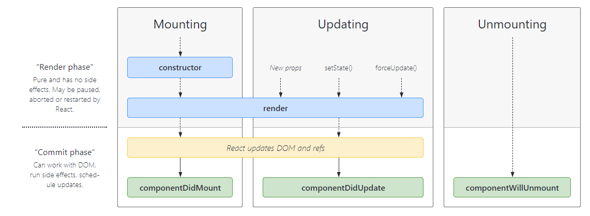

# Let's Get Classy

Class-based components

It is a older way of creating components inside React. 
Creating functional component is a new way of writing React code.

## Older projects still use Classbased components

Learning class-based components will help us to understand React overall.

## Creating State Variables inside Class-based components

We use a hook inside a functional component. 
Never update state variables directly. It will result in inconstencies. 
Example : this.count.state = this.state.count+1;
Whenever the state variables in updated, React will re-render the component with latest value of the state variable.

## Lifecycle of React class-based component 

How class-based component is mounted ? Loading and mounting are used interchangeably.
Lifecycle methods : 

Whenever a class is instantiated, the constructor is called.
Followed by constructor, render methid is called. 

When a class-based component calls class-based component, the order is 

1. constructor of parent class component
2. render method of parent class component
3. componentDidMount() of class component-- whether the component is mounted

Lifecylce with Parent-Child relationship

1. constructor of parent class component
2. render method of parent class component
3. constructor of child class component
4. render method of child class component
5. componentDidMount() of child class compnent -- whether the parent component mounted
6. componentDidMount() of parent class component-- whether the parent component mounted

componentDidMount is called only when the component is completely rendered on the page. 

### Use of componentDidMount()

It is used to make an API call. The reason API call is made inside componentDidMount is 
because it will re-render component once the API response is received. 

React will render the component as fast as possible by calling constructor and render inside Class-based component
React will make API-call and once it receives the response with data.
React will re-render the component with the data received from API call. 

This is similar to the useEffect hook in React functional components.

### Lifecycle methods with multiple instances of children

React does optimization by batching the Constructor and React of childs at same level and then call its 
componetDidMount

#### Render Phase (Constructir + Reder()) in a single batch
1. Parent Constructor
2. Parent Render
3. Clild-class-instance-01  Constructor
4. Clild-class-instance-01 Render
5. Clild-class-instance-02 Constructor
6. Clild-class-instance-02 Render

#### Commit Phase (DOM Manipulation, DOM loading, componentDidMount(), etc)
7.Clild-class-instance-01 componentDidMount
8. Clild-class-instance-02 componentDidMount
9. Parent componentDidMount

#### React Lifecycle Methods Diagram

;

Reference for above image - https://projects.wojtekmaj.pl/react-lifecycle-methods-diagram/

React is batching the Render phase for multiple components. 
The Commit phase is also batched. This phase consists of DOM loading.
DOM loading is an expensive operation/task and takes more time compared to render phase.
 Hence, it is batched and then the DOM is updated. 